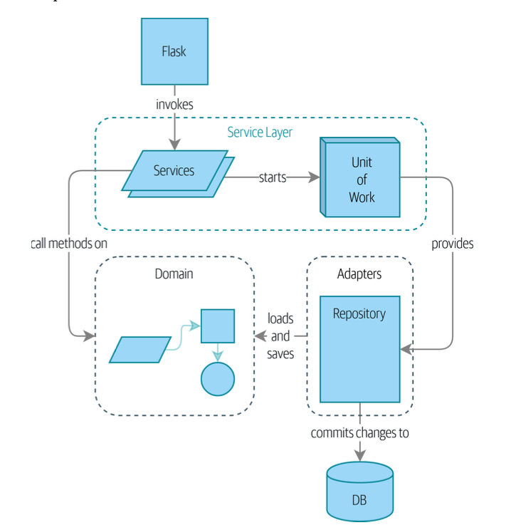

Layered architecture : 

- Presentation Layer
- Business Layer
- Data Access Layer

Layered architecture:
- Presentation Layer
    - This might be:
        - A web application
        - An API
- Business Layer
    - Contains:
        - Business logic
        - Business rules
- Data Access Layer

This model could be implemented by using one simple principle: dependency inversion principle.

With a formal definition:
- High-level modules should not depend on low-level modules. Both should depend on abstractions.
- Abstractions should not depend on details. Details should depend on abstractions.

depends on means in this case that one model knows about or needs another module.

